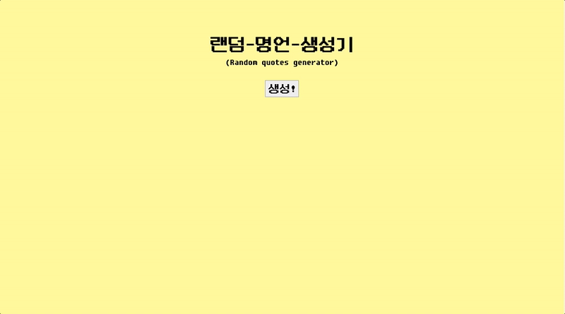

# 랜덤 명언 생성기 (Random quotes generator)

📎 [Demo](https://fromnowwon.github.io/random-quotes-generator/)




<br />

## Introduce
- 생성 버튼을 클릭하면 랜덤으로 명언이 생성됩니다.
- 복사 버튼을 클릭하면 명언이 복사됩니다. (영,한 구분)
- 영문 명언 API([goquotes](https://goquotes.docs.apiary.io/#reference/get-random-quote(s)/apiv1randomcount/get-random-quote(s)))에서 받아온 영문 데이터를 번역 API([kakao](https://developers.kakao.com/docs/latest/ko/translate/common))를 통해 한글로 번역하였습니다.

<br />

## API
- Go quotes API : 영문 명언을 렌덤으로 가져올 수 있는 API
- Kakao 번역 API : 번역 API

<br />

## Development Environment
- Client: Vanilla JavaScript, TypeScript, SCSS

<br/>

## Tree
```
random-quotes-generator
├── index.html
├── public (배포용 폴더)
├── src
│   ├── asset (정적 자원 관리)
│   │   ├── font (폰트)
│   │   │   └── DungGeunMo.ttf
│   │   └── images (이미지)
│   ├── index.ts (Entry point)
│   ├── copy.ts (클립보드 복사 모듈)
│   ├── fetchQuotes.ts (명언 가져오기 모듈)
│   ├── translation.ts (영한 번역 모듈)
│   ├── reset.scss (리셋 스타일)
│   └── style.scss (글로벌 스타일)
├── README.md
├── package-lock.json
├── package.json
├── tsconfig.json (타입스크립트 세팅)
└── webpack.config.js (웹팩 세팅)
```
<br />

